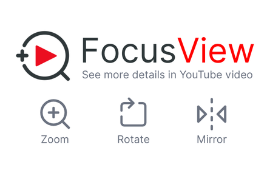
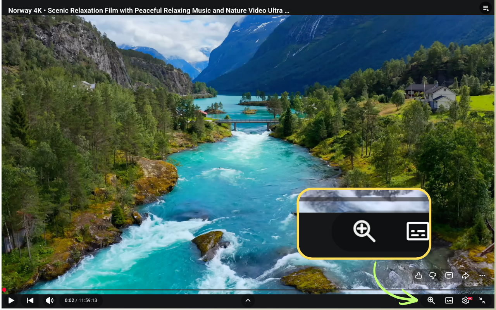
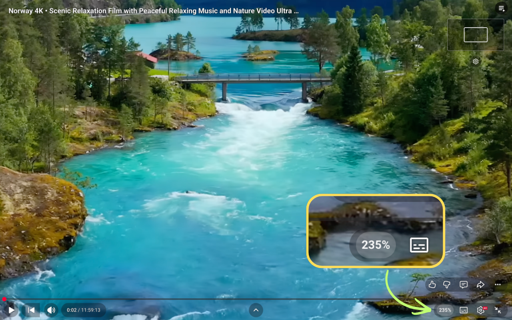

# FocusView

Reveal video details in YouTube videos.

FocusView adds smooth zoom, rotate, and mirror controls to YouTube videos in your browser.

Best for:

- concerts and livestreams
- sports clips
- lectures and tutorials
- any video where you want a closer look

[Watch the YouTube demo](https://www.youtube.com/watch?v=x4EzsXcOo_A)

[Download from the Chrome Web Store](https://chromewebstore.google.com/detail/jbdndcjclbghkmbiehjigaapembpbgdb?utm_source=github)

## Preview







## Features

- Press `Alt/Option + Shift + Z` to turn zoom mode on or off.
- In zoom mode, scroll to zoom videos from `100%` to `500%` around the mouse pointer, with each nonzero wheel or trackpad event capped at about fifteen percent and animated by at least one percent unless the zoom limit is reached.
- Outside zoom mode, page scrolling remains native so Safari trackpad and mouse wheel scrolling stay smooth. While zoom mode is on, wheel input inside the player is captured by player bounds even when Safari or YouTube routes the event through another overlay, and wheel-time UI updates are batched to keep non-fullscreen controls responsive.
- Long-press and drag to move around a zoomed video without leaving YouTube's 2x hold indicator on screen, while normal single-click play and pause stays unchanged.
- Use the zoom panel for centered `100%` to `500%` zoom control with aligned actions, matching label sizes, setting rows, the slider, and step buttons.
- Click **Fill** in the zoom settings to enlarge the video until player black bars are covered.
- Double-click the toolbar zoom control, or click **Reset**, to reset the video view and turn off zoom mode.
- Rotate videos by `90°`, `180°`, or `270°`.
- Mirror videos horizontally.

## Privacy And Permissions

FocusView does not collect data, does not track users, and does not send anything to external servers. All transforms happen locally in your browser.

The extension only runs on YouTube pages:

```json
"matches": ["https://www.youtube.com/*"]
```

It does not request storage, history, account, analytics, or extra network permissions.

See [PRIVACY.md](PRIVACY.md) for the full privacy policy.

## Install For Development

### Chrome

1. Open `chrome://extensions`.
2. Turn on **Developer mode**.
3. Click **Load unpacked**.
4. Select this project folder.
5. Open a normal YouTube video page.

### Microsoft Edge

1. Open `edge://extensions`.
2. Turn on **Developer mode**.
3. Click **Load unpacked**.
4. Select this project folder.
5. Open a normal YouTube video page.

### Safari

The macOS Safari Web Extension project is in `platforms/safari/FocusView`.

1. Open `platforms/safari/FocusView/FocusView.xcodeproj` in Xcode.
2. Select the `FocusView` scheme.
3. Run the macOS app target.
4. Open Safari Settings > Extensions.
5. Enable FocusView and allow access to YouTube.
6. Click the FocusView toolbar button and confirm the popup opens with the FocusView name, concise YouTube tagline, zoom mode shortcut hint, App Store rating CTA, and feedback link.
7. Open a normal YouTube video page and confirm the in-player controls appear.

## Mac App Store Release

FocusView is packaged for Safari as a macOS app with an embedded Safari Web Extension.

Planned store metadata:

- Chrome Web Store name: `FocusView – Zoom, Rotate & Mirror for YouTube`
- Apple App Store listing name: `FocusView - Zoom for YouTube`
- Safari extension name: `FocusView - Zoom for YouTube`
- Apple App Store subtitle: `Reveal Video Details`

1. In App Store Connect, create a macOS app record for `com.kodingai.focusview`.
2. In Xcode, open `platforms/safari/FocusView/FocusView.xcodeproj`.
3. Select the `FocusView` scheme and set your Apple Developer Team for the app and extension targets.
4. Confirm the app bundle ID is `com.kodingai.focusview`, the extension bundle ID is `com.kodingai.focusview.Extension`, and `ViewController.swift` uses the same extension identifier when opening Safari Extensions settings.
5. Select `Any Mac` as the run destination.
6. Choose Product > Archive.
7. In Organizer, choose Distribute App > App Store Connect > Upload.
8. In App Store Connect, select the uploaded build, complete the listing metadata, and submit it for review.

## Safari App Review Checklist

Before resubmitting after a Safari Web Extension rejection:

1. Delete any older FocusView app from `/Applications`.
2. In Safari Settings > Extensions, remove or disable older FocusView entries.
3. Install the archived App Store build, then launch the macOS container app.
4. Click **Quit and Open Safari Settings** and confirm Safari opens Extensions settings for FocusView.
5. Enable FocusView, allow access to YouTube, then open `https://www.youtube.com/watch?v=x4EzsXcOo_A`.
6. Click the Safari toolbar FocusView button and confirm the popup responds with the FocusView name, concise YouTube tagline, zoom mode shortcut hint, App Store rating CTA, and feedback link.
7. Confirm the YouTube player shows FocusView controls and zoom, rotate, mirror, and fill actions work.

## Development

Current version: `1.1.3`.

Run tests:

```sh
node --test
```

Build the release zip:

```sh
./scripts/build-release.sh
```

The release zip includes only the runtime files required by the extension:

- `manifest.json`
- `src/`
- `icons/`

Before App Store submission, replace the Safari popup review placeholder URL `https://apps.apple.com/app/id0000000000?action=write-review` with the live Mac App Store app ID URL.

## Limitations

- FocusView targets normal YouTube watch pages.
- Shorts, embedded YouTube iframes, and special live-player layouts are not the focus of version 1.
- FocusView prevents extra black borders caused by moving too far, and **Fill** can cover YouTube letterboxing or vertical-video side bars by cropping the video.
- Video transforms use CSS transforms, not canvas rendering, to keep the extension lightweight.

## Release Notes

See [CHANGELOG.md](CHANGELOG.md).
